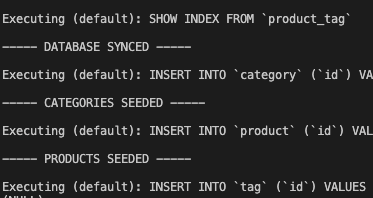

# BackEnd_for_eCommerce_13.1

## Title: E-Commerce Back-End
 

## Description:
This is an example back end for an e-commerce site. Express.js API and Sequelize to interact with a MySQL database.
  

## Links:  
repo: https://github.com/xnd0/BackEnd_for_eCommerce_13.1
  

## Screenshots:

 

## Technologies Used:
Javascript, CSS, NodeJS, MySQL, Express, Sequelize